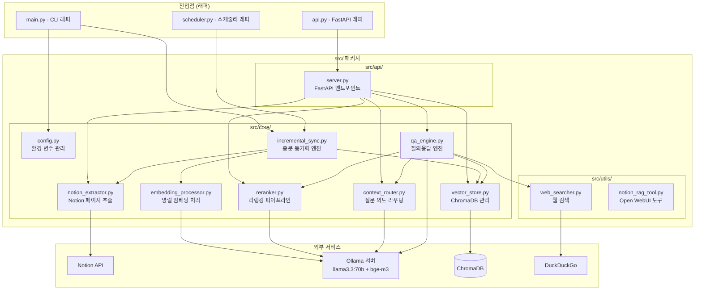
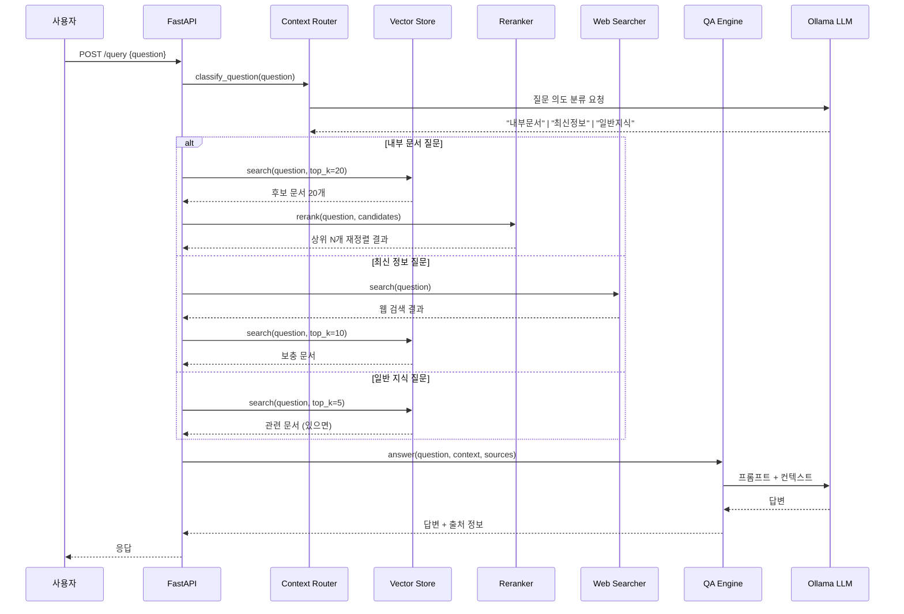
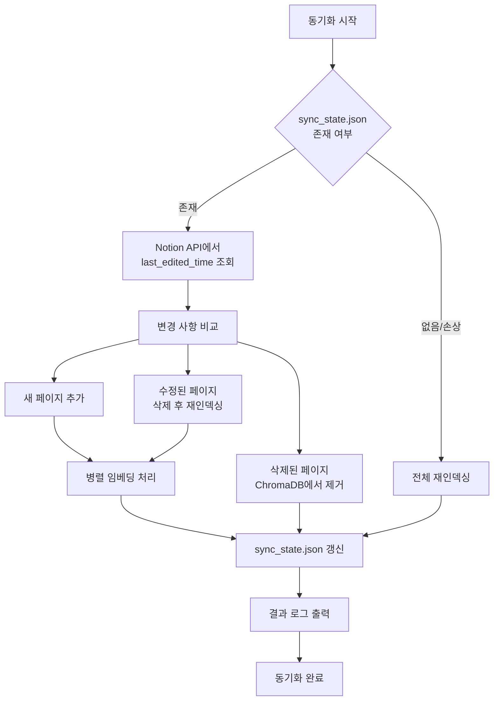

# 설계 문서: Notion RAG 시스템 고도화

## 개요

현재 Notion RAG 시스템은 루트(`main.py`, `api.py`, `config.py`)와 `src/` 디렉토리에 동일한 코드가 중복 존재하며, 전체 재인덱싱만 지원하고, 동기식 임베딩 처리로 인해 성능 병목이 발생하고 있다. 본 설계는 다음 목표를 달성한다:

1. `src/` 패키지 중심의 단일 코드 구조로 통합
2. Incremental Sync를 통한 변경분만 인덱싱
3. asyncio 기반 병렬 임베딩으로 RTX 3090 x4 활용 극대화
4. bge-reranker-v2-m3 기반 리랭킹 파이프라인 도입
5. LLM 기반 Context Routing으로 질문 의도별 정보 소스 우선순위 결정
6. 확장된 API 엔드포인트로 모니터링 및 제어 기능 제공

### 기술 스택

| 구성 요소 | 기술 |
|-----------|------|
| 언어 | Python 3.11 |
| LLM | Ollama (llama3.3:70b) |
| 임베딩 | bge-m3 (Ollama) |
| 리랭커 | bge-reranker-v2-m3 (sentence-transformers) |
| 벡터 DB | ChromaDB |
| API | FastAPI |
| 비동기 | asyncio + aiohttp |
| 스케줄러 | APScheduler |
| GPU | RTX 3090 x4 (96GB VRAM) |

## 아키텍처

### 전체 시스템 구조



### 쿼리 처리 파이프라인



### Incremental Sync 흐름




## 컴포넌트 및 인터페이스

### 1. ConfigManager (`src/core/config.py`)

환경 변수를 중앙 집중 관리하는 싱글톤 설정 모듈.

```python
# 환경 변수 정의
NOTION_TOKEN: str          # Notion API 토큰 (필수)
NOTION_PAGE_ID: str        # 기본 Notion 페이지 ID (선택)
OLLAMA_BASE_URL: str       # Ollama 서버 URL (필수)
OLLAMA_NUM_CTX: int        # LLM 컨텍스트 길이 (기본: 32768)
OLLAMA_KEEP_ALIVE: int     # 모델 상주 설정 (기본: -1)
OLLAMA_TIMEOUT: int        # API 타임아웃 초 (기본: 120)
OLLAMA_MAX_RETRIES: int    # 최대 재시도 횟수 (기본: 3)
EMBEDDING_CONCURRENCY: int # 동시 임베딩 요청 수 (기본: 8)
EMBEDDING_MAX_RETRIES: int # 임베딩 재시도 횟수 (기본: 3)
SEARCH_TOP_K: int          # 초기 검색 결과 수 (기본: 20)
RERANK_TOP_N: int          # 리랭킹 후 최종 결과 수 (기본: 5)
SYNC_INTERVAL_MINUTES: int # 자동 동기화 주기 (기본: 60)
SYNC_STATE_PATH: str       # 동기화 상태 파일 경로 (기본: ./sync_state.json)
```

```python
def load_config() -> dict:
    """환경 변수를 로드하고 필수 값 검증. 누락 시 ValueError 발생."""

def get_notion_client() -> Client:
    """Notion 클라이언트 싱글톤 반환."""
```

### 2. NotionPageExtractor (`src/core/notion_extractor.py`)

Notion API에서 페이지 콘텐츠를 추출하는 모듈. 기존 구현을 유지하되 `last_edited_time` 조회 기능을 추가한다.

```python
class NotionPageExtractor:
    def search_all_pages(self) -> List[Dict]:
        """워크스페이스의 모든 페이지 검색. last_edited_time 포함."""
    
    def get_page_content(self, page_id: str) -> Optional[Dict[str, str]]:
        """페이지 콘텐츠 추출 (page_id, title, content)."""
    
    def get_pages_with_timestamps(self) -> Dict[str, str]:
        """모든 페이지의 {page_id: last_edited_time} 매핑 반환."""
```

### 3. IncrementalSyncEngine (`src/core/incremental_sync.py`)

변경된 페이지만 선별하여 인덱싱하는 증분 동기화 엔진.

```python
@dataclass
class SyncResult:
    added: List[str]       # 추가된 페이지 ID 목록
    modified: List[str]    # 수정된 페이지 ID 목록
    deleted: List[str]     # 삭제된 페이지 ID 목록
    elapsed_seconds: float

class IncrementalSyncEngine:
    def __init__(self, extractor, vector_store, embedding_processor, state_path: str): ...
    
    def load_state(self) -> Dict[str, str]:
        """sync_state.json에서 {page_id: last_edited_time} 로드. 파일 없거나 손상 시 빈 dict 반환."""
    
    def save_state(self, state: Dict[str, str]) -> None:
        """동기화 상태를 sync_state.json에 저장."""
    
    def detect_changes(self, current: Dict[str, str], saved: Dict[str, str]) -> Tuple[List, List, List]:
        """변경 사항 감지. (added, modified, deleted) 반환."""
    
    async def sync(self) -> SyncResult:
        """증분 동기화 실행. 상태 파일 없으면 전체 재인덱싱."""
```

### 4. EmbeddingProcessor (`src/core/embedding_processor.py`)

asyncio + aiohttp 기반 병렬 임베딩 처리기.

```python
@dataclass
class EmbeddingResult:
    embeddings: List[List[float]]  # 성공한 임베딩 벡터
    failed_indices: List[int]      # 실패한 청크 인덱스
    total_count: int
    success_count: int
    elapsed_seconds: float

class EmbeddingProcessor:
    def __init__(self, base_url: str, model: str = "bge-m3",
                 concurrency: int = 8, max_retries: int = 3): ...
    
    async def embed_texts(self, texts: List[str]) -> EmbeddingResult:
        """여러 텍스트를 병렬로 임베딩. Semaphore로 동시 요청 수 제한."""
    
    async def embed_single(self, text: str) -> Optional[List[float]]:
        """단일 텍스트 임베딩. 실패 시 최대 max_retries 재시도."""
    
    def embed_query_sync(self, text: str) -> List[float]:
        """동기식 단일 쿼리 임베딩 (검색 시 사용)."""
```

### 5. VectorStoreManager (`src/core/vector_store.py`)

ChromaDB 벡터 저장소 관리 모듈.

```python
class VectorStoreManager:
    def __init__(self, persist_directory: str = "./chroma_db"): ...
    
    def add_chunks(self, page_id: str, title: str, chunks: List[str],
                   embeddings: List[List[float]]) -> None:
        """청크와 임베딩을 ChromaDB에 저장."""
    
    def delete_page(self, page_id: str) -> int:
        """페이지의 모든 청크 삭제. 삭제된 청크 수 반환."""
    
    def search(self, query_embedding: List[float], n_results: int = 20) -> List[Dict]:
        """벡터 유사도 검색. 결과에 distance 포함."""
    
    def get_collection_stats(self) -> Dict:
        """컬렉션 통계 (총 문서 수, 페이지 수 등) 반환."""
```

### 6. Reranker (`src/core/reranker.py`)

bge-reranker-v2-m3 모델을 사용한 리랭킹 모듈.

```python
@dataclass
class RankedDocument:
    content: str
    title: str
    page_id: str
    relevance_score: float

class Reranker:
    def __init__(self, model_name: str = "BAAI/bge-reranker-v2-m3"):
        """sentence-transformers CrossEncoder 로드."""
    
    def rerank(self, query: str, documents: List[Dict], top_n: int = 5) -> List[RankedDocument]:
        """문서를 relevance score 기준으로 재정렬하여 상위 N개 반환."""
```

### 7. ContextRouter (`src/core/context_router.py`)

질문 의도를 분류하여 정보 소스 우선순위를 결정하는 라우팅 모듈.

```python
class QuestionCategory(Enum):
    INTERNAL_DOC = "내부 문서 질문"
    LATEST_INFO = "최신 정보 질문"
    GENERAL_KNOWLEDGE = "일반 지식 질문"

@dataclass
class RoutingDecision:
    category: QuestionCategory
    use_notion: bool
    use_web: bool
    notion_weight: float  # 0.0 ~ 1.0
    web_weight: float     # 0.0 ~ 1.0

class ContextRouter:
    def __init__(self, base_url: str, model: str = "llama3.3:70b"): ...
    
    def classify(self, question: str) -> RoutingDecision:
        """LLM을 사용하여 질문 의도를 분류하고 라우팅 결정 반환."""
```

### 8. QAEngine (`src/core/qa_engine.py`)

리랭킹과 Context Routing을 통합한 질의응답 엔진.

```python
@dataclass
class AnswerResult:
    answer: str
    sources: List[Dict]        # 사용된 출처 목록
    source_type: str           # "notion" | "web" | "general" | "mixed"
    category: QuestionCategory

class QAEngine:
    def __init__(self, vector_store, reranker, context_router, web_searcher, config): ...
    
    def answer(self, question: str, session_id: str = None,
               use_reranking: bool = True) -> AnswerResult:
        """질문에 대한 답변 생성. Context Routing → 검색 → 리랭킹 → LLM 답변."""
```

### 9. FastAPI 서버 (`src/api/server.py`)

확장된 API 엔드포인트.

```python
# 기존 엔드포인트 유지
GET  /              # index.html 서빙
GET  /health        # 헬스 체크
GET  /pages         # 페이지 목록
POST /index-all     # 전체 인덱싱
POST /index         # 개별 인덱싱
POST /update        # 페이지 업데이트
POST /delete        # 페이지 삭제
POST /query         # RAG 질의 (use_reranking 파라미터 추가)
POST /append        # 페이지 내용 추가
POST /create-page   # 페이지 생성

# 신규 엔드포인트
POST /sync          # Incremental Sync 수동 트리거
GET  /sync/status   # 마지막 동기화 상태 조회
```


## 데이터 모델

### sync_state.json

Incremental Sync 상태를 저장하는 JSON 파일.

```json
{
  "last_sync_time": "2024-01-15T03:00:00Z",
  "pages": {
    "page-id-1": "2024-01-14T10:30:00.000Z",
    "page-id-2": "2024-01-15T02:15:00.000Z"
  }
}
```

### ChromaDB 메타데이터 스키마

```python
{
    "page_id": str,          # Notion 페이지 ID
    "title": str,            # 페이지 제목
    "chunk_index": int,      # 청크 순서 인덱스
    "last_edited_time": str  # 마지막 수정 시간 (신규 추가)
}
```

### API 요청/응답 모델

```python
# 쿼리 요청 (확장)
class QueryRequest(BaseModel):
    question: str
    session_id: Optional[str] = None
    n_results: Optional[int] = 3
    use_web_search: Optional[bool] = True
    use_reranking: Optional[bool] = True  # 신규

# 쿼리 응답 (확장)
class QueryResponse(BaseModel):
    status: str                    # "success" | "error"
    answer: str
    sources: List[Dict[str, str]]
    source_type: str               # "notion" | "web" | "general" | "mixed"
    session_id: str

# 동기화 응답
class SyncResponse(BaseModel):
    status: str
    message: str
    added: int
    modified: int
    deleted: int
    elapsed_seconds: float

# 동기화 상태 응답
class SyncStatusResponse(BaseModel):
    status: str
    last_sync_time: Optional[str]
    total_pages: int
    last_result: Optional[Dict]
```

### 환경 변수 (.env)

```dotenv
# Notion API 설정
NOTION_TOKEN=secret_xxx
NOTION_PAGE_ID=xxx

# Ollama 서버 설정
OLLAMA_BASE_URL=http://localhost:11434
OLLAMA_NUM_CTX=32768
OLLAMA_KEEP_ALIVE=-1
OLLAMA_TIMEOUT=120
OLLAMA_MAX_RETRIES=3

# 임베딩 설정
EMBEDDING_CONCURRENCY=8
EMBEDDING_MAX_RETRIES=3

# 검색 설정
SEARCH_TOP_K=20
RERANK_TOP_N=5

# 동기화 설정
SYNC_INTERVAL_MINUTES=60
SYNC_STATE_PATH=./sync_state.json
```

### 패키지 구조

```
project-root/
├── main.py                    # CLI 래퍼 (src 모듈 호출)
├── api.py                     # FastAPI 래퍼 (src.api.server 호출)
├── scheduler.py               # 스케줄러 래퍼 (src 모듈 호출)
├── src/
│   ├── __init__.py
│   ├── core/
│   │   ├── __init__.py
│   │   ├── config.py              # 환경 변수 중앙 관리
│   │   ├── notion_extractor.py    # Notion 페이지 추출
│   │   ├── embedding_processor.py # 병렬 임베딩 처리
│   │   ├── vector_store.py        # ChromaDB 관리
│   │   ├── incremental_sync.py    # 증분 동기화 엔진
│   │   ├── reranker.py            # 리랭킹 파이프라인
│   │   ├── context_router.py      # 질문 의도 라우팅
│   │   └── qa_engine.py           # 질의응답 엔진
│   ├── api/
│   │   ├── __init__.py
│   │   └── server.py              # FastAPI 엔드포인트
│   └── utils/
│       ├── __init__.py
│       ├── web_searcher.py        # 웹 검색
│       └── notion_rag_tool.py     # Open WebUI 도구
├── tests/
│   ├── conftest.py
│   ├── test_config.py
│   ├── test_incremental_sync.py
│   ├── test_embedding.py
│   ├── test_vector_store.py
│   ├── test_reranker.py
│   ├── test_context_router.py
│   ├── test_qa_engine.py
│   └── test_api.py
├── docker-compose.yml
├── Dockerfile
├── requirements.txt
├── .env / .env.example
├── index.html
├── sync_state.json            # 동기화 상태 (자동 생성)
└── chroma_db/                 # 벡터 DB (자동 생성)
```


## 정확성 속성 (Correctness Properties)

*정확성 속성(Property)은 시스템의 모든 유효한 실행에서 참이어야 하는 특성 또는 동작이다. 속성은 사람이 읽을 수 있는 명세와 기계가 검증할 수 있는 정확성 보장 사이의 다리 역할을 한다.*

### Property 1: 필수 환경 변수 누락 시 ValueError 발생

*For any* 필수 환경 변수(NOTION_TOKEN, OLLAMA_BASE_URL)가 누락된 경우, `load_config()`를 호출하면 `ValueError`가 발생해야 하며, 에러 메시지에 누락된 변수명이 포함되어야 한다.

**Validates: Requirements 1.5**

### Property 2: 동기화 상태 Round-Trip

*For any* 유효한 `{page_id: last_edited_time}` 딕셔너리에 대해, `save_state()`로 저장한 후 `load_state()`로 로드하면 원래 딕셔너리와 동일한 값을 반환해야 한다.

**Validates: Requirements 2.1**

### Property 3: 변경 감지 정확성

*For any* 두 개의 `{page_id: last_edited_time}` 딕셔너리(saved, current)에 대해, `detect_changes(current, saved)`는 다음을 만족해야 한다:
- added: current에만 존재하는 page_id 집합과 동일
- modified: 양쪽에 존재하지만 timestamp가 다른 page_id 집합과 동일
- deleted: saved에만 존재하는 page_id 집합과 동일

**Validates: Requirements 2.2, 2.4, 2.5**

### Property 4: 손상된 상태 파일 처리

*For any* 유효하지 않은 JSON 문자열(임의의 바이트 시퀀스)이 sync_state.json에 저장된 경우, `load_state()`는 예외를 발생시키지 않고 빈 딕셔너리를 반환해야 한다.

**Validates: Requirements 2.6**

### Property 5: 임베딩 처리 결과 무결성

*For any* 텍스트 목록에 대해 `embed_texts()`를 실행하면, 반환된 `EmbeddingResult`에서 `success_count + len(failed_indices) == total_count`가 성립해야 하며, 실패한 청크가 있더라도 나머지 청크의 임베딩은 정상적으로 반환되어야 한다.

**Validates: Requirements 3.3, 3.5**

### Property 6: 재시도 로직 동작

*For any* 재시도 가능한 작업(임베딩, Ollama API 호출)에서, 연속 실패 횟수가 `max_retries` 이하이면 최종적으로 성공해야 하고, `max_retries`를 초과하면 실패로 처리되어야 한다.

**Validates: Requirements 3.4, 4.4**

### Property 7: 환경 변수 설정 Round-Trip

*For any* 설정 가능한 환경 변수(OLLAMA_NUM_CTX, OLLAMA_KEEP_ALIVE, SEARCH_TOP_K, RERANK_TOP_N, SYNC_INTERVAL_MINUTES 등)에 대해, 환경 변수로 유효한 정수 값을 설정한 후 `load_config()`를 호출하면 설정한 값과 동일한 정수가 반환되어야 한다.

**Validates: Requirements 4.3, 5.5, 7.2**

### Property 8: 리랭킹 결과 정렬 및 Score 존재

*For any* 쿼리 문자열과 문서 목록에 대해, `rerank()`의 반환 결과는 `relevance_score` 기준 내림차순으로 정렬되어야 하며, 모든 `RankedDocument`에 유효한 `relevance_score`(float)가 존재해야 한다.

**Validates: Requirements 5.1, 5.3**

### Property 9: 리랭킹 결과 수 제한

*For any* 문서 목록과 `top_n` 값에 대해, `rerank()`의 반환 결과 길이는 `min(top_n, len(documents))` 이하여야 한다.

**Validates: Requirements 5.2**

### Property 10: Context Routing 카테고리별 가중치 일관성

*For any* `RoutingDecision`에 대해:
- `INTERNAL_DOC`이면 `notion_weight > web_weight`이고 `use_notion == True`
- `LATEST_INFO`이면 `web_weight > notion_weight`이고 `use_notion == True`이고 `use_web == True`
- `GENERAL_KNOWLEDGE`이면 `notion_weight`와 `web_weight`가 모두 0.5 미만

**Validates: Requirements 6.1, 6.2, 6.3, 6.4**

### Property 11: 답변 결과 출처 유효성

*For any* `AnswerResult`에 대해, `source_type`은 반드시 `"notion"`, `"web"`, `"general"`, `"mixed"` 중 하나여야 하며, `sources` 리스트가 비어있지 않으면 `source_type`이 `"general"`이 아니어야 한다.

**Validates: Requirements 6.5**

### Property 12: API 응답 형식 통일

*For any* API 엔드포인트 호출에 대해, 응답 JSON에는 반드시 `"status"` 키가 존재해야 하며, 그 값은 `"success"` 또는 `"error"` 중 하나여야 한다.

**Validates: Requirements 8.4**


## 에러 처리

### 에러 처리 전략

| 컴포넌트 | 에러 상황 | 처리 방식 |
|----------|----------|----------|
| ConfigManager | 필수 환경 변수 누락 | `ValueError` + 한글 에러 메시지 (변수명 포함) |
| NotionPageExtractor | Notion API 호출 실패 | 에러 로그 출력, `None` 반환 |
| EmbeddingProcessor | 개별 청크 임베딩 실패 | 최대 3회 재시도 → 실패 시 건너뛰기, failed_indices에 기록 |
| EmbeddingProcessor | Ollama 서버 연결 실패 | 최대 3회 재시도 (지수 백오프: 1초, 2초, 4초) |
| VectorStoreManager | ChromaDB 조작 실패 | 에러 로그 출력, 예외 전파 |
| Reranker | 리랭커 모델 호출 실패 | 리랭킹 건너뛰기, 원래 검색 결과 사용 (graceful degradation) |
| ContextRouter | LLM 분류 실패 | 기본값 `INTERNAL_DOC`으로 폴백 |
| QAEngine | LLM 답변 생성 실패 | 한글 에러 메시지 반환 |
| IncrementalSyncEngine | sync_state.json 손상/부재 | 전체 재인덱싱 수행, 새 상태 파일 생성 |
| Scheduler | 자동 인덱싱 중 오류 | 에러 로그 기록, 다음 실행 시점에 재시도 |
| FastAPI | API 요청 처리 예외 | 적절한 HTTP 상태 코드 + 한글 에러 메시지 |

### 재시도 전략

```python
# 지수 백오프 재시도 패턴
async def retry_with_backoff(func, max_retries=3, base_delay=1.0):
    for attempt in range(max_retries):
        try:
            return await func()
        except Exception as e:
            if attempt == max_retries - 1:
                raise
            delay = base_delay * (2 ** attempt)
            print(f"⚠️ 재시도 {attempt + 1}/{max_retries} ({delay}초 후)")
            await asyncio.sleep(delay)
```

### Graceful Degradation 체인

```
리랭커 실패 → 원래 검색 결과 사용
Context Router 실패 → 기본 INTERNAL_DOC 모드
웹 검색 실패 → Notion 문서만 사용
Notion 검색 실패 → LLM 기본 지식만 사용
```

## 테스트 전략

### 테스트 프레임워크

- 단위 테스트: `pytest`
- 속성 기반 테스트: `hypothesis` (Python PBT 라이브러리)
- 비동기 테스트: `pytest-asyncio`
- 모킹: `unittest.mock` + `aioresponses`

### 속성 기반 테스트 (Property-Based Testing)

각 정확성 속성은 `hypothesis`를 사용하여 최소 100회 반복 테스트한다. 각 테스트에는 설계 문서의 속성 번호를 태그로 포함한다.

```python
# 태그 형식 예시
# Feature: notion-rag-enhancement, Property 2: 동기화 상태 Round-Trip

@given(state=st.dictionaries(
    keys=st.text(min_size=1, max_size=36),
    values=st.text(min_size=1, max_size=30)
))
@settings(max_examples=100)
def test_sync_state_round_trip(state):
    """Feature: notion-rag-enhancement, Property 2: 동기화 상태 Round-Trip"""
    engine = IncrementalSyncEngine(...)
    engine.save_state(state)
    loaded = engine.load_state()
    assert loaded == state
```

### 단위 테스트

단위 테스트는 구체적인 예시, 엣지 케이스, 통합 포인트를 검증한다:

- ConfigManager: 기본값 로드, 필수 변수 누락 시 에러, num_ctx/keep_alive 기본값 확인
- IncrementalSyncEngine: 빈 상태에서 전체 인덱싱, 손상된 JSON 파일 처리
- EmbeddingProcessor: 빈 텍스트 목록, 단일 텍스트 임베딩
- Reranker: 빈 문서 목록, 리랭커 실패 시 폴백
- ContextRouter: 각 카테고리별 분류 예시
- API: 각 엔드포인트 정상/에러 응답, POST /sync 트리거, GET /sync/status 조회, use_reranking 파라미터 동작

### 테스트 디렉토리 구조

```
tests/
├── conftest.py              # 공통 fixture (모킹, 임시 파일 등)
├── test_config.py           # ConfigManager 테스트
├── test_incremental_sync.py # IncrementalSyncEngine 테스트
├── test_embedding.py        # EmbeddingProcessor 테스트
├── test_vector_store.py     # VectorStoreManager 테스트
├── test_reranker.py         # Reranker 테스트
├── test_context_router.py   # ContextRouter 테스트
├── test_qa_engine.py        # QAEngine 테스트
└── test_api.py              # FastAPI 엔드포인트 테스트
```

### 테스트 실행

```bash
# 전체 테스트
pytest tests/ -v

# 속성 기반 테스트만
pytest tests/ -v -k "property"

# 특정 모듈 테스트
pytest tests/test_incremental_sync.py -v
```
